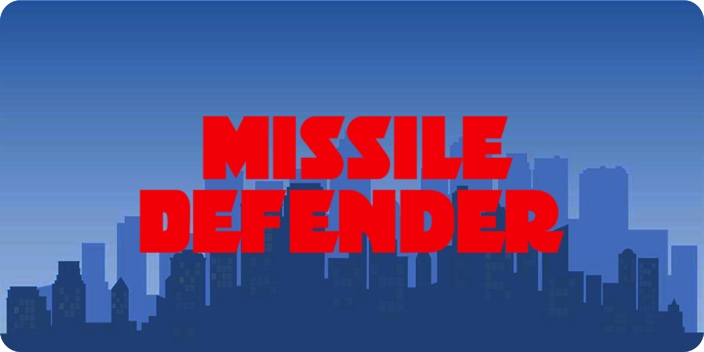
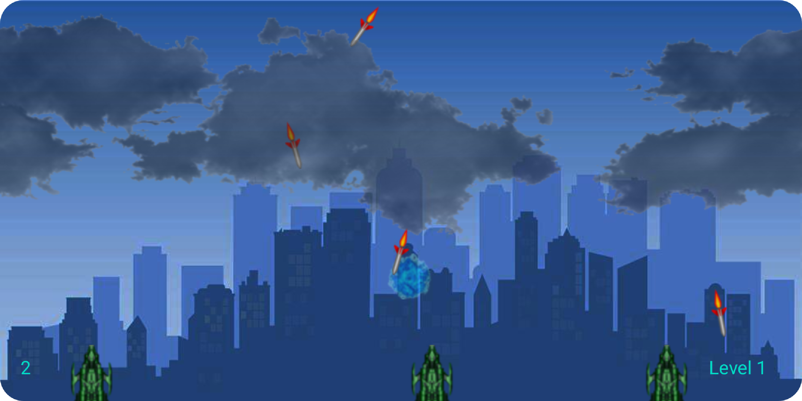
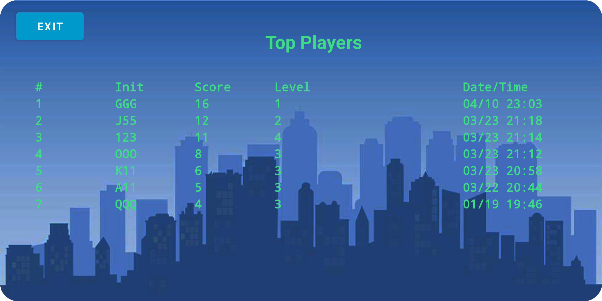

# MissileDefenderAndroid

This Android application is a game that involves a barrage of missiles falling down to the ground. The client has control of three bases which can fire interceptors at the missiles
to cause them to explode. The missiles also explode when they hit the ground and if a base is within the blast radius of the missile's explosion, the base is destoryed. 

The game ends when all three bases are destoryed. 

## App Highlights

1. As the game progresses along, the levels of the game increases and the missiles come down faster and more frequently. 
2. The game has a background of scrolling clouds that fluctuate in terms of their brightness. 
3. A base can only fire three interceptors at a given time. 
4. If a base fires an interceptor close to its location, it can cause itself to explode. 
5. When the game is finished, the final score is compared to a database. If the score falls within the top ten scores, the user can enter initials and the score is displayed within the leaderboard.
6. The app is designed to only run in landscape mode.  

## Techniques and Libraries Used

Dynamic Views, Object Animators, ValueAnimator, Interpolators, SoundPool, MotionEvents, Scrolling Background, TouchEvents, Remote Database, Threads

## Screen Shots

  
